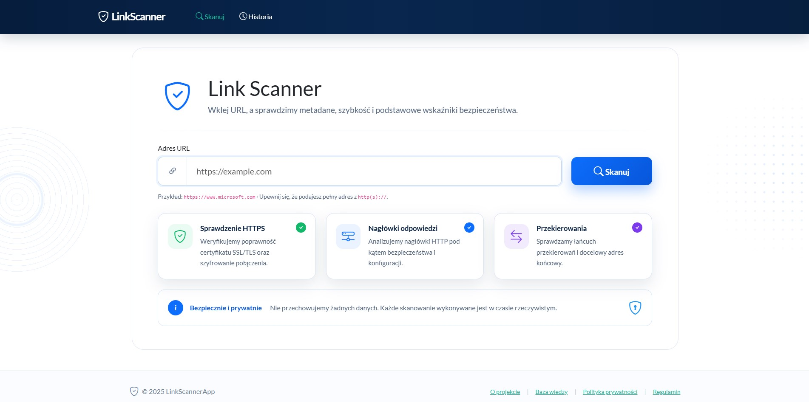
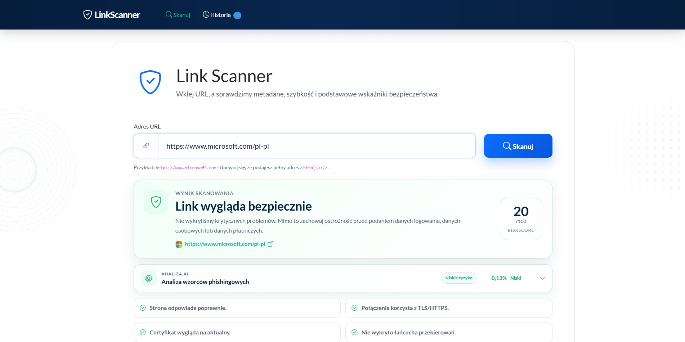
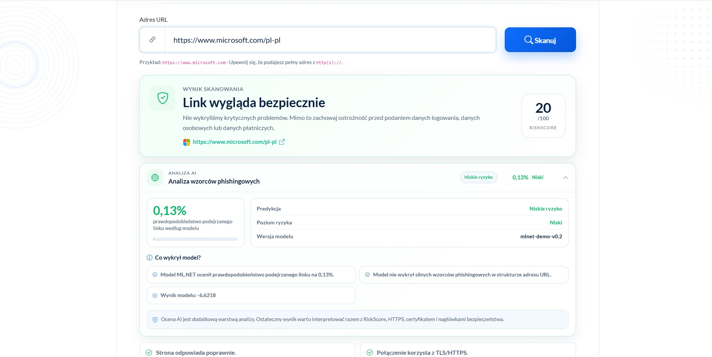
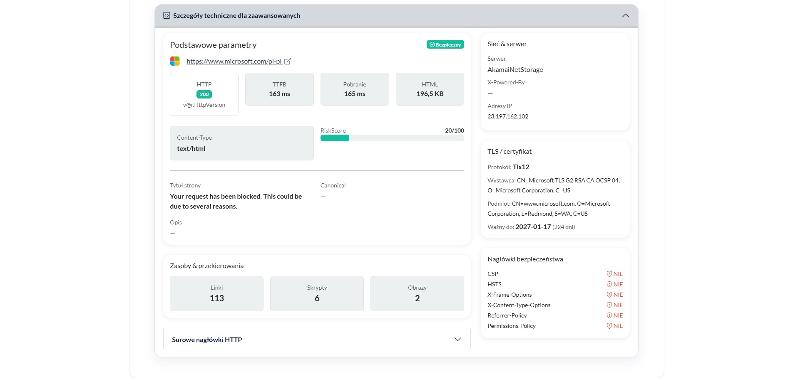

# LinkScanner


**LinkScanner** is a web application for analyzing URLs and estimating whether a website is potentially safe or suspicious.

The project combines a user-facing Razor Pages interface with a backend scanning pipeline that validates a submitted URL, follows redirects in a controlled way, fetches page metadata, analyzes HTTP/TLS/security-related information, calculates a rule-based risk score and enriches the result with a local **ML.NET-based AI threat assessment**.

The application was created as a portfolio project focused on **web security, clean architecture, backend engineering, observability, AI-assisted classification and production-oriented coding practices**.

---

## Table of contents

- [Project goal](#project-goal)
- [Main features](#main-features)
- [Screenshots](#screenshots)
- [Tech stack](#tech-stack)
- [Architecture](#architecture)
- [Project structure](#project-structure)
- [How the scanning flow works](#how-the-scanning-flow-works)
- [AI threat classification](#ai-threat-classification)
- [Security and reliability mechanisms](#security-and-reliability-mechanisms)
- [Configuration](#configuration)
- [API usage](#api-usage)
- [Getting started](#getting-started)
- [Running tests](#running-tests)
- [Training the ML.NET model](#training-the-mlnet-model)
- [Docker](#docker)
- [Current status](#current-status)
- [Roadmap](#roadmap)
- [Portfolio value](#portfolio-value)
- [Author](#author)
- [Disclaimer](#disclaimer)

---

## Project goal

The main goal of LinkScanner is to provide a simple tool that helps users check whether a link looks trustworthy before opening it.

From the engineering perspective, the project is designed to show practical backend skills:

- building an ASP.NET Core application in .NET 8,
- separating responsibilities between application, domain, infrastructure and presentation layers,
- working with dependency injection,
- using structured logging with Serilog,
- protecting public endpoints with rate limiting,
- validating and limiting untrusted user input,
- designing a scanning pipeline that can be extended with new analyzers,
- combining rule-based URL analysis with a local ML.NET classifier,
- preparing the project for deployment and future product development.

---

## Main features

### URL scanning

The application accepts a URL from the user and performs a technical scan. The scan can include:

- URL validation,
- HTTP request execution with timeout control,
- redirect analysis,
- HTML metadata extraction,
- TLS certificate analysis,
- HTTP security headers analysis,
- host/IP resolution,
- risk score calculation,
- final safety decision.

### AI threat assessment

The project includes a local ML.NET-based classifier that analyzes URL-related features and returns an additional AI assessment.

The AI assessment can include:

- predicted label,
- suspicious probability,
- threat level,
- model version,
- top reasons explaining the prediction.

The AI result is displayed in the web interface as an additional decision-support signal.

### Web interface

The project contains a Razor Pages frontend that allows the user to scan a link from the browser and review the result in a readable format.

### REST API

The application exposes an API endpoint that can be used by external clients or future integrations.

```http
POST /api/scan
Content-Type: application/json

"https://example.com"
```

### Logging

Serilog is configured for structured logging to the console and rolling log files. This makes the application easier to debug and closer to production-style diagnostics.

### Rate limiting

The scan endpoint is protected with a fixed-window rate limit policy based on the caller IP address. This helps reduce abuse and protects the application from excessive scanning requests.

### Request and scan limits

The application contains configurable limits such as:

- maximum URL length,
- allowed ports,
- HTTP timeout,
- maximum redirects,
- maximum downloaded HTML size,
- maximum request body size,
- maximum number of concurrent scans.

---

## Screenshots

Below are screenshots presenting the current version of the LinkScanner web interface and scan result view.

### Home page

The main page allows the user to enter a URL and start a security scan.



### Scan result

After scanning a URL, the application displays the final safety decision, risk score and the most important security indicators.



### AI assessment

The application includes an additional ML.NET-based phishing pattern analysis.  
The AI assessment is displayed as a separate section and should be interpreted together with the rule-based RiskScore, HTTPS, certificate and security headers analysis.



### Technical details

Advanced users can expand the technical details section to inspect HTTP status, response time, downloaded HTML size, server information, IP addresses, TLS certificate data, security headers and extracted metadata.



---

## Tech stack

| Area | Technology |
|---|---|
| Backend | .NET 8, ASP.NET Core |
| Frontend | Razor Pages, HTML, CSS, JavaScript |
| API | ASP.NET Core Controllers |
| Architecture | Clean Architecture-inspired layered structure |
| AI / ML | ML.NET, local binary classification model |
| Model training | Console trainer project in `tools/LinkScanner.ModelTrainer` |
| Logging | Serilog |
| Rate limiting | ASP.NET Core Rate Limiting |
| Tests | xUnit / .NET test project |
| Deployment readiness | Dockerfile included |

---

## Architecture

The solution is divided into separate projects:

```text
LinkScanner
├── src
│   ├── LinkScannerApp
│   ├── LinkScanner.Application
│   ├── LinkScanner.Domain
│   └── LinkScanner.Infrastructure
├── tests
│   └── LinkScanner.Tests
└── tools
    └── LinkScanner.ModelTrainer
```

### `LinkScannerApp`

Presentation layer of the application.

Responsible for:

- application startup,
- HTTP pipeline configuration,
- Razor Pages frontend,
- API controllers,
- middleware registration,
- rate limiting,
- security headers,
- global exception handling,
- request size limiting,
- Serilog request logging,
- displaying scan results and AI assessment in the UI.

### `LinkScanner.Application`

Application layer containing use cases and abstractions.

Responsible for:

- application use cases,
- scan command handling,
- interfaces used by infrastructure,
- application options,
- scan orchestration,
- abstractions for URL validation, scanning and threat classification.

Example use case:

```text
UseCases/ScanUrl
```

### `LinkScanner.Domain`

Domain layer containing core business entities, result models and enums.

Responsible for:

- scan result models,
- AI threat assessment model,
- domain-level data structures,
- keeping core concepts independent from external infrastructure.

### `LinkScanner.Infrastructure`

Infrastructure layer containing technical implementations.

Responsible for:

- URL validation implementation,
- HTTP fetching,
- redirect handling,
- HTML metadata extraction,
- TLS certificate analysis,
- security headers analysis,
- risk score calculation,
- host/IP resolution,
- ML.NET threat classification,
- URL feature extraction,
- concurrency limiting.

### `LinkScanner.ModelTrainer`

Tooling project used to train and save the local ML.NET model.

Responsible for:

- loading training data from CSV,
- building the ML.NET pipeline,
- training the binary classification model,
- evaluating the model on a holdout test split,
- saving the model file used by the web application.

---

## Project structure

A simplified view of the most important folders:

```text
src/
├── LinkScannerApp/
│   ├── Controllers/
│   │   └── ScanController.cs
│   ├── Extensions/
│   ├── Middleware/
│   ├── Options/
│   ├── Pages/
│   ├── wwwroot/
│   ├── Program.cs
│   ├── appsettings.json
│   └── Dockerfile
│
├── LinkScanner.Application/
│   ├── Abstractions/
│   ├── Options/
│   ├── ThreatIntelligence/
│   ├── UseCases/
│   │   └── ScanUrl/
│   └── DependencyInjection.cs
│
├── LinkScanner.Domain/
│   ├── Entities/
│   └── Enums/
│
└── LinkScanner.Infrastructure/
    ├── MachineLearning/
    │   ├── Models/
    │   │   └── phishing-url-model.zip
    │   ├── MlNetThreatClassifier.cs
    │   └── ThreatFeatureExtractor.cs
    ├── Scanning/
    │   ├── Analyzers/
    │   ├── Http/
    │   └── LinkScannerService.cs
    ├── Validation/
    └── DependencyInjection.cs

tools/
└── LinkScanner.ModelTrainer/
    ├── Data/
    ├── Models/
    ├── Program.cs
    └── LinkScanner.ModelTrainer.csproj
```

---

## How the scanning flow works

The scan flow is designed as a pipeline:

1. The user submits a URL through the web UI or API.
2. `ScanController` receives the request.
3. The controller passes the request to the `ScanUrlHandler` use case.
4. The application layer validates and orchestrates the scan.
5. Infrastructure services perform technical analysis of the target URL.
6. Analyzers collect signals such as redirects, metadata, TLS and security headers.
7. A rule-based risk score is calculated.
8. The ML.NET classifier extracts URL features and generates an AI threat assessment.
9. A final scan result is returned to the user.

Simplified flow:

```text
User / Browser
     │
     ▼
Razor Pages / API Controller
     │
     ▼
ScanUrlHandler
     │
     ▼
URL Validator
     │
     ▼
LinkScannerService
     │
     ├── RedirectAnalyzer
     ├── HtmlMetadataExtractor
     ├── SecurityHeadersAnalyzer
     ├── TlsCertificateAnalyzer
     ├── HostIpResolver
     ├── RiskScoreCalculator
     ├── SafetyDecisionAnalyzer
     └── MlNetThreatClassifier
              │
              └── ThreatFeatureExtractor
     │
     ▼
Scan result + AI assessment
```

---

## AI threat classification

LinkScanner contains a local AI classification module based on ML.NET.

The classifier is not an external API integration. It runs locally inside the application and uses a trained model file:

```text
src/LinkScanner.Infrastructure/MachineLearning/Models/phishing-url-model.zip
```

### Extracted features

The model is based on URL-related features such as:

- URL length,
- number of dots,
- number of hyphens,
- number of digits,
- number of special characters,
- HTTPS usage,
- IP address used as host,
- presence of `@` symbol,
- subdomain count,
- suspicious keyword count.

The feature extractor also prepares additional technical signals that can be useful for future model improvements, such as:

- status code,
- redirect count,
- risk score,
- title and description presence,
- links/scripts/images count,
- mixed content flag,
- selected security headers,
- HTML size,
- load time,
- certificate days to expiry.

### Suspicious keywords

The current feature extractor checks for common phishing-related keywords, for example:

```text
login, verify, account, secure, update, bank, paypal, wallet,
password, confirm, signin, security, billing
```

### AI output

The AI module can return:

- `isSuspicious`,
- `probability`,
- `threatLevel`,
- `predictedLabel`,
- `modelVersion`,
- `topReasons`.

Example conceptual response:

```json
{
  "isSuspicious": false,
  "probability": 0.18,
  "threatLevel": "Low",
  "predictedLabel": "Niskie ryzyko",
  "modelVersion": "mlnet-demo-v0.2",
  "topReasons": [
    "Model ML.NET ocenił prawdopodobieństwo podejrzanego linku na 18.00%.",
    "Model nie wykrył silnych wzorców phishingowych w strukturze adresu URL."
  ]
}
```

### Important note

The AI classifier should be treated as an additional portfolio/educational decision-support mechanism, not as a complete commercial phishing detection engine. Its quality depends on the training data, selected features and model evaluation process.

---

## Security and reliability mechanisms

LinkScanner scans external URLs, so the project includes several mechanisms that are important when working with untrusted input.

### Input validation

The application validates submitted URLs before scanning them.

Validation is intended to reject malformed or unsafe addresses before the application attempts to connect to them.

### Allowed ports

The configuration limits scanning to selected ports, currently:

```json
"AllowedPorts": [80, 443]
```

### Timeout control

HTTP requests use a configurable timeout:

```json
"HttpTimeoutSeconds": 8
```

### Redirect limits

Redirect processing is limited:

```json
"MaxRedirects": 5
```

### HTML size limit

The amount of downloaded HTML is limited:

```json
"MaxHtmlBytes": 1000000
```

### Request body size limit

The request body size is limited:

```json
"MaxScanRequestBodyBytes": 4096
```

### Rate limiting

The scan endpoint uses rate limiting:

```json
"RateLimiting": {
  "ScanPermitLimit": 10,
  "WindowSeconds": 60,
  "QueueLimit": 0
}
```

When the limit is exceeded, the API returns `429 Too Many Requests` with a retry hint.

### Security headers

The web application uses custom security headers middleware.

### Global exception handling

Unexpected exceptions are handled by global middleware, which improves reliability and prevents leaking implementation details to the client.

### Controlled redirects

The HTTP client is configured with automatic redirects disabled, so redirects can be analyzed manually and limited by application logic.

---

## Configuration

Main configuration is stored in:

```text
src/LinkScannerApp/appsettings.json
```

Example configuration:

```json
{
  "LinkScanner": {
    "HttpTimeoutSeconds": 8,
    "MaxRedirects": 5,
    "MaxHtmlBytes": 1000000,
    "MaxUrlLength": 2048,
    "AllowedPorts": [80, 443]
  },
  "RateLimiting": {
    "ScanPermitLimit": 10,
    "WindowSeconds": 60,
    "QueueLimit": 0
  },
  "RequestLimits": {
    "MaxScanRequestBodyBytes": 4096
  }
}
```

---

## API usage

### Scan URL

```http
POST /api/scan
Content-Type: application/json
```

Request body:

```json
"https://example.com"
```

Example using PowerShell:

```powershell
Invoke-RestMethod `
  -Uri "https://localhost:5001/api/scan" `
  -Method Post `
  -ContentType "application/json" `
  -Body '"https://example.com"'
```

Example using cURL:

```bash
curl -X POST "https://localhost:5001/api/scan" \
  -H "Content-Type: application/json" \
  -d '"https://example.com"'
```

Possible successful response contains a structured scan result with information collected during analysis.

Possible error response:

```json
{
  "error": "Invalid URL."
}
```

When the rate limit is exceeded, the API returns HTTP `429 Too Many Requests`.

---

## Getting started

### Prerequisites

Install:

- [.NET 8 SDK](https://dotnet.microsoft.com/download/dotnet/8.0)
- Git
- Visual Studio 2022 or Visual Studio Code

### Clone repository

```bash
git clone https://github.com/PatrykMojs/LinkScanner.git
cd LinkScanner
git checkout develop
```

### Restore dependencies

```bash
dotnet restore
```

### Build solution

```bash
dotnet build
```

### Run application

```bash
dotnet run --project src/LinkScannerApp/LinkScannerApp.csproj
```

After startup, open the local address displayed in the console, for example:

```text
https://localhost:5001
```

or

```text
http://localhost:5000
```

The exact port may depend on local launch settings.

---

## Running tests

Run all tests:

```bash
dotnet test
```

Run only the test project:

```bash
dotnet test tests/LinkScanner.Tests/LinkScanner.Tests.csproj
```

---

## Training the ML.NET model

The repository contains a separate console tool for training the ML.NET phishing URL model:

```text
tools/LinkScanner.ModelTrainer
```

Run the trainer:

```bash
dotnet run --project tools/LinkScanner.ModelTrainer/LinkScanner.ModelTrainer.csproj
```

The trainer loads training data from:

```text
tools/LinkScanner.ModelTrainer/Data/phishing-training-data.csv
```

Then it trains the model and saves the generated `.zip` model file to:

```text
src/LinkScanner.Infrastructure/MachineLearning/Models/phishing-url-model.zip
```

The web application loads this model at runtime and uses it to generate the AI threat assessment.

---

## Docker

The project contains a Dockerfile in the web application project.

Example build command:

```bash
docker build -t linkscanner -f src/LinkScannerApp/Dockerfile .
```

Example run command:

```bash
docker run -p 8080:8080 linkscanner
```

Then open:

```text
http://localhost:8080
```

> Depending on the final Docker configuration, the exposed port may need to be adjusted.

---

## Current status

The project currently includes:

- core URL scanning flow,
- Razor Pages web interface,
- REST API endpoint,
- structured logging with Serilog,
- rate limiting,
- request body size limiting,
- configurable scan limits,
- security headers middleware,
- global exception handling,
- rule-based risk score,
- local ML.NET threat classifier,
- ML.NET model trainer tool,
- test project structure,
- Dockerfile.

---

## Roadmap

Planned or possible future improvements:

- [ ] Improve the ML.NET training dataset.
- [ ] Add more realistic phishing and legitimate URL samples.
- [ ] Add model evaluation notes to the documentation.
- [ ] Combine rule-based score and AI assessment into a clearer final verdict.
- [ ] Add scan history.
- [ ] Add user accounts.
- [ ] Add public demo deployment.
- [ ] Add GitHub Actions CI pipeline.
- [ ] Add more unit and integration tests.
- [ ] Add OpenAPI/Swagger documentation.
- [ ] Add more screenshots and a short demo video.
- [ ] Add Google AdSense integration after deployment.
- [ ] Add more detailed explanation of each risk factor in the UI.
- [ ] Add exportable scan reports.

---

## Portfolio value

This project demonstrates:

- practical ASP.NET Core development,
- layered architecture,
- clean separation of responsibilities,
- working with untrusted user input,
- HTTP communication and redirect analysis,
- security-oriented thinking,
- structured logging,
- API design,
- configuration-driven application behavior,
- testable architecture,
- local ML.NET model integration,
- building a separate model training tool,
- presenting AI output in a user-facing web application.

---

## Author

**Patryk Meus**  
GitHub: [PatrykMeus](https://github.com/PatrykMojs)

---

## Disclaimer

LinkScanner is a portfolio and educational project. It can help identify suspicious technical signals, but it should not be treated as a complete security product or a replacement for professional security tools.

The AI classifier is an additional experimental layer and should be interpreted together with the technical scan result, not as a standalone source of truth.
